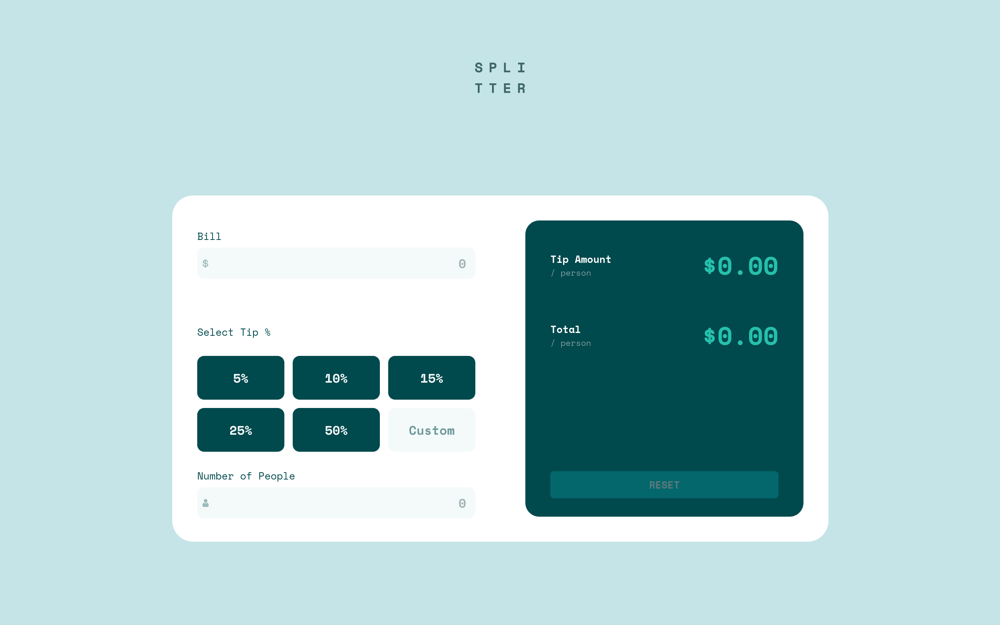
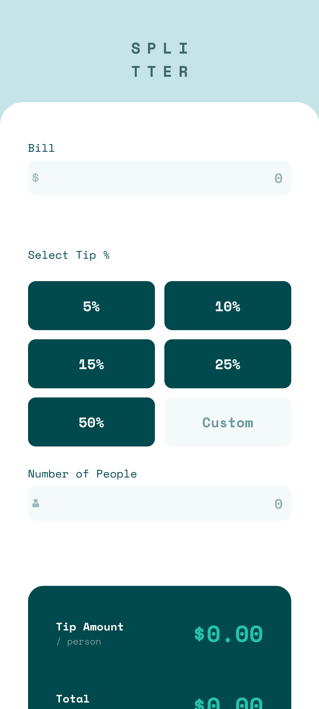

# Frontend Mentor - Tip calculator app solution

This is a solution to the [Tip calculator app challenge on Frontend Mentor](https://www.frontendmentor.io/challenges/tip-calculator-app-ugJNGbJUX). Frontend Mentor challenges help you improve your coding skills by building realistic projects.

## Table of contents

- [Overview](#overview)
  - [The challenge](#the-challenge)
  - [Screenshots](#screenshots)
  - [Links](#links)
- [My process](#my-process)
  - [Built with](#built-with)
  - [What I learned](#what-i-learned)
- [Author](#author)

## Overview

### The challenge

Users should be able to:

- View the optimal layout for the app depending on their device's screen size
- See hover states for all interactive elements on the page
- Calculate the correct tip and total cost of the bill per person

### Screenshots
**Desktop**

**Mobile**

### Links

- Solution URL: [Frontend Mentor Solution](https://your-solution-url.com)
- Live Site URL: [Live Site](https://azi-01.github.io/Tip-Calculator-Solution/)

## My process
I used html, css and javavscript to build this. My workflow was desktop first and then I built the mobile version.

### Built with

- Semantic HTML5 markup
- CSS custom properties
- Flexbox
- CSS grid
- Javascript

### What I learned

- How to use grid
- How to process data and display it using javascript

## Author

- Frontend Mentor - [@Azi-01](https://www.frontendmentor.io/profile/Azi-01)
- Instagram - [@Azi00.00](https://www.instagram.com/azi00.00)
